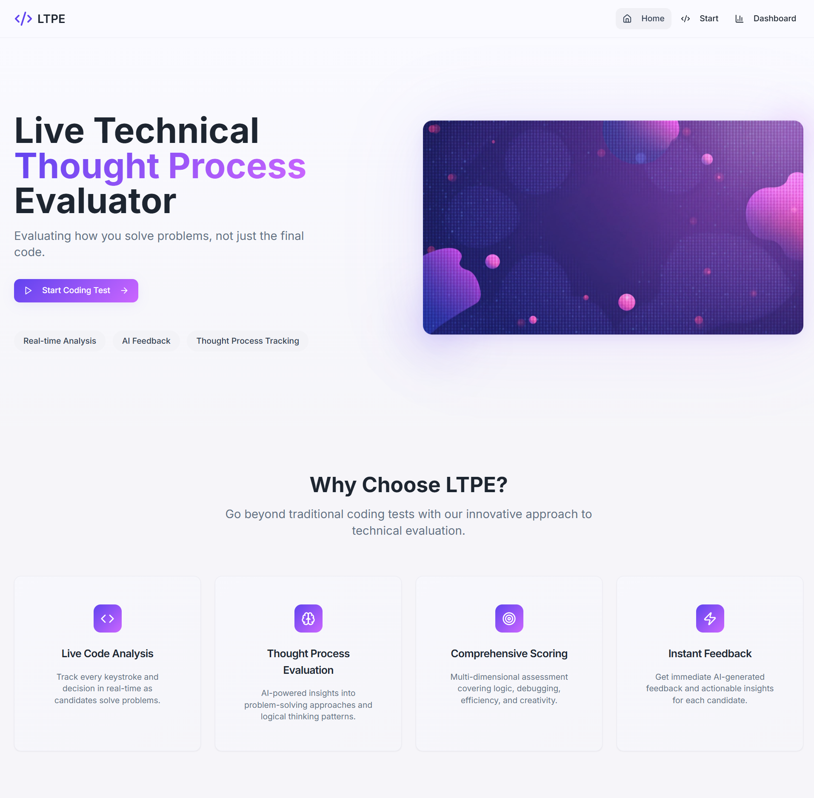
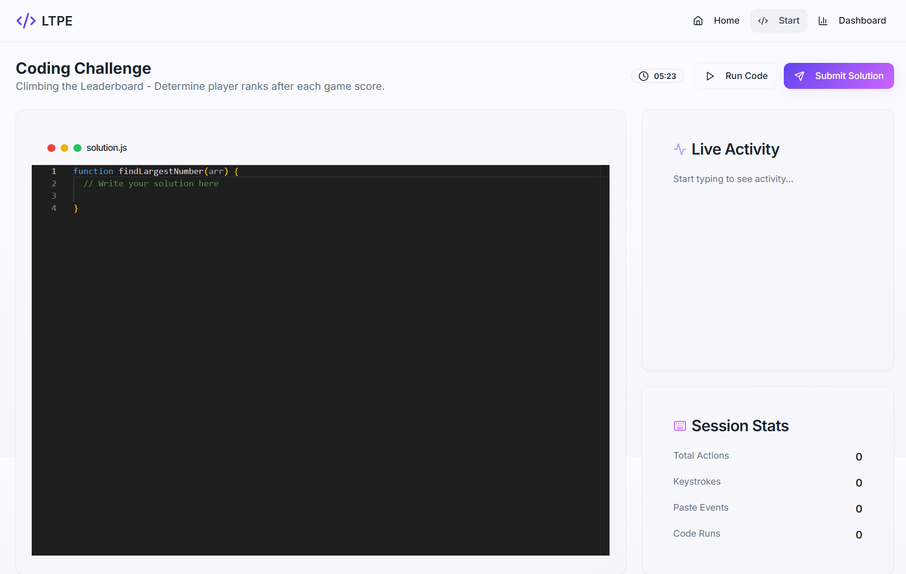

# 💡 Live Technical Thought Process Evaluator

## 📌 Overview

The **Live Technical Thought Process Evaluator** is a platform designed to **analyze how candidates solve coding problems in real-time**, not just their final solution.
It captures **key logs, code runs, edits, refactors, and timeline events** while integrating with **Worqhat APIs** for **code analysis and NLP feedback**.

This project was built as part of a hackathon to showcase **next-gen interview evaluation tools** that focus on *problem-solving methodology* rather than only final outputs.

---

## ✨ Features

* 🖊️ **Code Editor** – Candidate-friendly coding environment.
* ⌨️ **Key Logs Tracking** – Captures keystrokes, edits, copy-paste events.
* 🔄 **Run Tracking** – Tracks number of code executions and refactors.
* ⏳ **Timeline** – Displays chronological sequence of coding actions.
* 📊 **Worqhat API Integration** – For AI-powered evaluation and NLP-based feedback.
* 📑 **Dashboard** – Provides structured reports for evaluators.

---

## 🛠️ Tech Stack

* **Frontend:** React.js, TailwindCSS
* **Backend:** Node.js, Express.js
* **AI/Analysis:** Worqhat APIs (Code Analysis + NLP Feedback)

---

## ⚙️ Installation

1. **Clone the repo**

   ```bash
   git clone https://github.com/<your-username>/<your-repo>.git
   cd <your-repo>
   ```

2. **Install dependencies**

   ```bash
   npm install
   ```

3. **Set up environment variables**
   Create a `.env` file in the root directory:

   ```env
   WORQHAT_API_KEY=your_worqhat_api_key
   ```

4. **Run the backend**

   ```bash
   npm run server
   ```

5. **Run the frontend**

   ```bash
   npm run dev
   ```

---

## 🚀 Usage

1. Start the app as an interviewer or candidate.
2. Candidates write and run code in the editor.
3. All keystrokes, logs, runs, and edits are tracked automatically.
5. Worqhat APIs provide **AI-based analysis + feedback**.
6. Evaluators view reports on the **dashboard**.

---

## 📸 Screenshots




---

## 🙌 Team & Contributions

This project was developed during a hackathon by:

* 👤 **Nitish Sahu** 
* 👤 **Manthan Sali** 
* 👤 **Aditya Rana** 

Contributions are welcome! Please feel free to fork this repo and submit pull requests.

---
